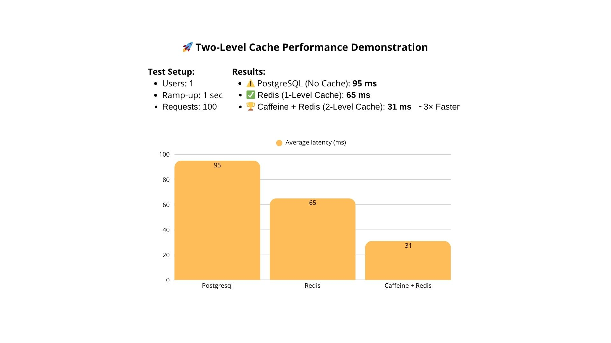

# Java Spring Boot Two-Level Cache Demo

This project is a **Spring Boot** application demonstrating the use of a **two-level caching system** to improve performance and reduce database load.

The caching architecture consists of:

- **L1 (Caffeine Cache)** – Fast in-memory cache stored inside the JVM.
- **L2 (Redis Cache)** – Distributed cache shared across service instances.
- **Database** – PostgreSQL for persistent storage.

---

## 📌 Features

- Demonstrates **two-level caching**:  
  First checks **Caffeine (L1)** → then **Redis (L2)** → finally queries the database if not found in either cache.
- Uses **PostgreSQL** with **Flyway migrations** to initialize schema and test data.
- Provides **REST endpoints** to test and compare performance.
- Includes **Apache JMeter test file** for benchmarking.
- Implements **custom cache logic** via `CustomCache` and `CustomCacheManager`.

---

## 🌐 API Endpoints
| Endpoint | Description |
| -------- | ----------- |
| **GET** `/category/find-all` | Fetch data directly from the database. | 
| **GET** `/category/find-all-cache-redis` | Fetch data from Redis (L2 cache only). |
| **GET** `/category/find-all-cache-two-level` | 	Fetch data from the two-level cache (Caffeine + Redis). |

## 📊 Load Testing with JMeter

- The root folder contains two_level_cache.jmx.

- Open it in Apache JMeter.
- Run the test plan to compare:
  - Direct DB queries
  - Redis-only cache
  - Two-level cache

---

## ✅ Benefits of Two-Level Caching

- 1.Minimal latency for repeated requests
  - L1 → nanoseconds–milliseconds, L2 → 1–5 ms.

- 2.Database load reduction
  - Even after service restarts, Redis serves requests without hitting the DB.

- 3.Persistence across restarts
  - Caffeine resets, Redis keeps data.

- 4.Cluster scalability
  - L1 is local to each instance, L2 is shared.

- 5.Flexible TTL and size control

- 6.Balanced speed and memory usage

- 7.Graceful degradation
  - If Redis is unavailable → queries go directly to the DB.

## 📂 Architecture Overview

```plaintext
Client → L1: Caffeine → L2: Redis → Database
```

--- 

## ℹ️ Data Example
The demo application uses data on products and categories. Other projects may use other reference data, such as regions and districts, tariffs and interest rates, etc.

---

## 📊 Latency diagram



